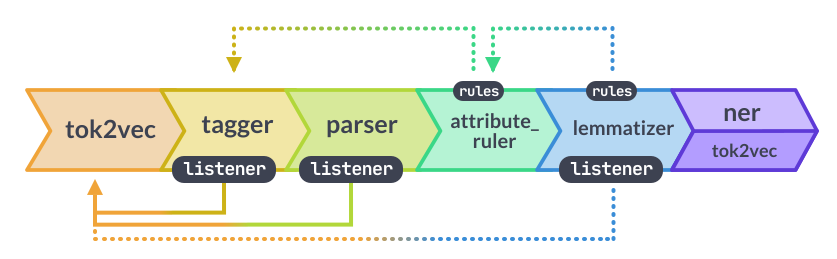

<!--- quarto add r-wasm/quarto-live ----->
<!--- 
mkdir -p .qmd-pause && mv *.qmd .qmd-pause/ && \
  quarto add r-wasm/quarto-live; \
  mv .qmd-pause/* . && rmdir .qmd-pause
----->



## Dagens program 

- **Tekst som data**

- **Korpus**

- **Landskabet** (hvad kan man med computationel tekstanalyse?)

- **Ordbogsmodeller** ... og en analyse af den politiske dagsorden

- **Sprogmodeller** ... og en analyse af tonen i Folketinget

- **Klyngemodeller** ... små PCA og k-means analyser

- Øvelser/**Portfolio** 

<br>

::: {.aside}
Ingen R-kode i disse slides. Vi arbejder med værktøjer, der ikke har et meningsfuldt alternativ i R, der kan køre i browseren (mig bekendt). Dog kan alt det I ser i dag, også gennemføres i R lokalt og med andre værktøjer. 
:::

## Dagens data

Referater af møderne i Folketinget fra oktober 2007 til november 2022.

- **1.711 møder**, hentet fra ft.dk i december 2022.

- Hvert møde er delt op i dagsordenspunkter, og hvert punkt har hele debatten som én tekst.

- Vi bruger **1. behandlingen af lovforslag**.

<br>

::: {.incremental}

**3.070 debatter** og cirka **22 millioner ord**.

:::

## Korpusset

```{pyodide}
#| autorun: true
import pandas as pd
import numpy as np

url = "https://raw.githubusercontent.com/jeppeFQ/SDS1-lektion-7/refs/heads/main/resources/ft_udsnit.csv"
korpus = pd.read_csv(url)

print(korpus.shape)
print(korpus[["aar", "lovnr", "omraade"]].head())
```

<details>
<summary>Noter til koden</summary>

Læs det oppefra og ned:

1. `import pandas as pd` og `import numpy as np`: Hent de to biblioteker, og giv dem de korte navne `pd` og `np`.
2. `url = ...`: Adressen på filen på GitHub. `raw.githubusercontent.com` giver selve filen og ikke GitHubs webside om filen.
3. `pd.read_csv(url)`: Læs CSV-filen direkte fra nettet ind i en DataFrame.
4. `korpus.shape`: Antal rækker og kolonner, som `(rækker, kolonner)`.
5. `korpus[["aar", "lovnr", "omraade"]]`: Vælg tre kolonner. De dobbelte klammer betyder, at vi giver en **liste** af kolonnenavne.
6. `.head()`: Vis de første fem rækker.

</details>

<br>

Et tilfældigt udsnit på **900 debatter**. Hver tekst er afkortet til de første 5.000 tegn.

# Del 1: Tekst som data

## Tekst?!

Hvad er tekst egentlig, når vi tænker det i abstrakte termer?

<br>

::: {.incremental}

`"Hej med dig!"`

Vi forstår øjeblikkeligt: det er en hilsen, det er på dansk, det er venligt.

:::

## Hvad computeren ser

```
"Hej med dig!"
        ↓
01001000 01100101 01101010 ...
        ↓
[72, 101, 106, 32, 109, 101, 100, ...]
        ↓
['H', 'e', 'j', ' ', 'm', 'e', 'd', ...]
```

<br>

- Computeren ser tal og symboler. Den "forstår" ingen betydning.

- Alt, hvad vi laver i dag, handler om at bygge en bro fra det nederste niveau til det øverste ... og få et kritisk blik for, hvor meget der går tabt undervejs.

## Det I allerede kan

1. Gør teksten til små bogstaver
2. Fjern tegnsætning
3. Del op i ord
4. Tæl ordene i en dictionary
5. Find de hyppigste

<br>

Det er en **bag-of-words**-model. Rækkefølgen smides væk, og tilbage står en optælling. Det er fundamentet under det meste af i dag.

# Del 2: Korpus

## Fra referat til korpus

Det rå materiale er ikke et korpus. Det bliver det, fordi vi træffer valg.

| Trin | Antal |
|---|---:|
| Møder i Folketinget | 1.711 |
| Dagsordenspunkter | 27.106 |
| ... heraf 1. behandling af lovforslag | 3.143 |
| ... uden punkter, der er udgået | **3.070** |

<br>

::: {.incremental}

Hvert trin er en beslutning om, hvad der tæller som "en politisk debat". 

:::

## Hvad er "en tekst" her?

```{pyodide}
#| autorun: false
print(korpus.loc[0, "tekst"][:600])
```

<details>
<summary>Noter til koden</summary>

1. `korpus.loc[0, "tekst"]`: Vælg rækken med indeks `0` og kolonnen `tekst`. Det er én celle, altså én debat.
2. `[:600]`: De første 600 tegn. En tekststreng kan skæres over på samme måde som en liste.

</details>

<br>

- Én tekst er **hele debatten** om et lovforslag: formanden, ordførerne, ministeren, spørgsmål og svar

- Der står **ikke**, hvem der siger hvad. Talerne introduceres kun af formanden i løbende tekst

::: {.incremental}

Vi kan altså sammenligne **lovforslag** ... men ikke partier eller politikere. Det er en **designbegrænsning**.

:::

## Fire spørgsmål til ethvert korpus

1. **Hvor kommer teksterne fra?** Ét medie eller flere? Hvem har valgt netop dem?

2. **Hvem har skrevet dem?** Redigeret eller spontant? Én forfatter eller mange?

3. **Hvilke teksttyper er med og hvilke er evt. ikke?**

4. **Hvad skete der under indsamlingen?** Hvad blev der af formatering, billedtekster, kommentarer?

# Del 3: Hvad kan man?

## Fem metodefamilier

Macanovic (2022) inddeler feltet i fem:

1. **Ordbogsmodeller**: tæl foruddefinerede ord i kategorier
2. **Semantisk og netværksanalyse**: hvem gør hvad ved hvem (sprogligt, grammatisk)
3. **Sprogrepræsentationer**: tekst som tal (DTM, n-gram, word embeddings)
4. **Usuperviseret klyngedannelse**: find temaer, ingen har defineret på forhånd
5. **Superviseret klassifikation**: udvid manuel kodning til millioner af tekster

<br>

::: {.incremental}

I dag rører vi ved nummer 1 og lidt af nummer 3 og 5. Resten kommer mere i fokus på SDS2.

:::

## Validering

- **Korpusvalidering**: repræsenterer materialet det, I tror?

- **Metodisk validering**: måler modellen det, I tror?

<br>

::: {.incremental}

Når statistisk fit og fortolkelighed trækker i hver sin retning, skal der træffes et valg. Det valg hører i metodeafsnittet.

:::

# Del 4: Ordbogsmodeller

## Hvad er en ordbogsmodel?

En liste af ord, hver med en værdi. Man slår hvert ord op og lægger sammen.

- **LIWC**: 82 psykologiske kategorier
- **AFINN**: cirka 3.500 danske ord med en score fra −5 til +5
- **Jeres egen**: en liste, I selv definerer til ét bestemt spørgsmål

<br>

Det er den mest **gennemsigtige** metodefamilie. I kan altid slå op, hvorfor en tekst fik sin score, men det er også den mest **restriktive**. Modellen ved kun det, listen siger.

## Vi bygger én

```{pyodide}
#| autorun: true
ordbog = {
    "god": 2, "godt": 2, "bedre": 2, "bedst": 3, "stærk": 2,
    "sand": 2, "sandhed": 2, "frihed": 3, "tryghed": 2, "stolt": 2,
    "dårlig": -2, "værre": -2, "værst": -3, "katastrofe": -3,
    "løgn": -3, "svigt": -2, "trussel": -2, "farlig": -2,
    "krise": -2, "vold": -3, "frygt": -2, "svag": -2
}

print(len(ordbog), "ord")
```

<details>
<summary>Noter til koden</summary>

- `ordbog` er navnet på vores variabel.      
- `{ }` fortæller Python, at vi laver en **dictionary** (ordbog).      
- En ordbog består af nøgler og værdier: `"god"   →  2`       
    `god` er nøgle; `2` er værdi. 

</details>

<br>

22 ord. Det er hele "modellen". 

## Hvordan den scorer

```{pyodide}
#| autorun: false
# ét ord per række. Indekset husker, hvilken debat ordet kom fra
ord = (korpus["tekst"].astype(str)
       .str.lower()
       .str.replace(r"[^\wæøå ]", " ", regex=True)
       .str.split().explode())

print("tokens:", len(ord), "| typer:", ord.nunique())
```

<details>
<summary>Noter til koden</summary>

Læs det oppefra og ned:

1. `korpus["tekst"]`: Hent kolonnen `tekst` fra DataFrame'en `korpus`.       
2. `.astype(str)`: Sørg for, at alt er tekst.     
3. `.str.lower()`: Lav alle bogstaver om til små bogstaver.       
4. `.str.replace(...)`: Erstatter tegn, der **ikke** er bogstaver, tal eller mellemrum, med et mellemrum.     
5. `.str.split()`: Del teksten op ved mellemrum.        
6. `.explode()`: Tager en liste og laver én række for hvert element i listen.     

</details>

## Kør den på korpusset

```{pyodide}
#| autorun: false
# slå hvert ord op i ordbogen og læg sammen per debat
korpus["score"] = ord.map(ordbog).groupby(level=0).sum()

print(korpus.groupby("omraade")["score"].mean().round(2).sort_values())
print()
print("Debatter med score præcis 0:", (korpus["score"] == 0).sum(), "af", len(korpus))
```

<details>
<summary>Noter til koden</summary>

Læs det oppefra og ned:

1. `ord.map(ordbog)`: Slå hvert ord op i ordbog.      
2. `.groupby(level=0)`: `level=0` betyder, at gruppering er efter det første indeksniveau, altså debatten.
3. `.sum()`: Læg tallene sammen.       
4. `korpus["score"] =`: Til sidst gemmer vi resultatet i vores oprindelige DataFrame.         
5. `korpus.groupby("omraade")["score"].mean()`: Gennemsnitlig score for hvert politikområde, afrundet og sorteret.
6. `(korpus["score"] == 0).sum()`: `True` for hver debat med score 0. `.sum()` tæller dem, fordi `True` tæller som 1.

</details>

<br>

`.map(ordbog)` slår hvert ord op. Findes ordet ikke i ordbogen, bliver det `NaN` ... og `NaN` tæller ikke med, når vi lægger sammen.

## Hvad fylder i scoren?

```{pyodide}
#| autorun: false
print(ord[ord.isin(ordbog.keys())].value_counts().head(8))
```

<details>
<summary>Noter til koden</summary>

Læs det indefra og ud:

1. `ordbog.keys()`: Nøglerne i ordbogen, altså de 22 ord.
2. `ord.isin(...)`: `True` for hvert token, der står i ordbogen.
3. `ord[...]`: Behold kun de tokens, hvor det er `True`.
4. `.value_counts()`: Tæl, hvor mange gange hvert ord forekommer, sorteret med det hyppigste først.
5. `.head(8)`: De otte hyppigste.

</details>

<br>

::: {.incremental}

Det mest hyppige ord er **`godt`**: 1.381 gange. Mere end dobbelt så ofte som det næste.

Men i Folketinget betyder `godt` sjældent, at noget er godt. Det er *"det er godt, at ministeren ..."* og *"godt, så går vi videre"*. **Scoren er i vid udstrækning en optælling af et høflighedsord.**

:::

## Negation

```{pyodide}
#| autorun: false
test = pd.Series(["Det er en god beslutning",
                     "Det er ikke en god beslutning",
                     "Ingen tryghed og ingen frihed"])

scorer = (test.str.lower().str.split().explode()
          .map(ordbog).groupby(level=0).sum())

print(pd.DataFrame({"tekst": test, "score": scorer}))
```

<details>
<summary>Noter til koden</summary>

1. `pd.Series([...])`: Tre testsætninger som en Series. Indekset `0`, `1`, `2` er sætningens nummer.
2. `.str.lower().str.split().explode()`: Samme opskrift som på korpusset: små bogstaver, del op i ord, ét ord per række.
3. `.map(ordbog)`: Slå hvert ord op. Ord, der ikke er i ordbogen, bliver `NaN`.
4. `.groupby(level=0).sum()`: Læg sammen per sætning.
5. `pd.DataFrame({"tekst": test, "score": scorer})`: Sæt teksten og scoren side om side. Rækkerne passer sammen, fordi de har samme indeks.

</details>

<br>

En ordbogsmodel lægger tal sammen. **Den læser ikke.**


## AFINN

Den samme idé, professionelt lavet. `afinn` er et Python-bibliotek med en dansk ordliste på cirka 3.500 ord, udviklet af Finn Årup Nielsen.

```python
from afinn import Afinn

afinn = Afinn(language="da")

korpus["afinn"] = korpus["tekst"].map(afinn.score)
```

<details>
<summary>Noter til koden</summary>

1. `from afinn import Afinn`: Hent `Afinn` fra pakken `afinn`.
2. `Afinn(language="da")`: Lav et objekt med den danske ordliste og gem det som `afinn`.
3. `korpus["tekst"].map(afinn.score)`: Kør `.score()` på hver tekst, og gem resultatet i en ny kolonne.
4. Bemærk: `afinn.score` står **uden** parenteser. Vi giver funktionen til `.map()`, som selv kalder den én gang for hver tekst.

</details>

<br>

`.score()` gør præcis det samme som vores egen funktion. Den slår hvert ord op og lægger værdierne for ordene sammen.

::: {.aside}
Kan ikke installeres i browseren. Kør den i UCloud eller lokalt.
:::

## Hvad måler vi egentlig?

Hvis Retsvæsen scorer lavere end Beskæftigelse, hvad har vi så vist?

- At debatterne handler om noget negativt, som vold og straf?
- At ordførerne er mere kritiske?
- At ordlisten passer bedre til det ene områdes ordforråd end det andets?
- ... eller at man siger `godt` sjældnere, når man taler om kriminalitet?

<br>

# Analyse: "Kriser" i Folketingssalen

> Fyldte italesættelsen af "kriser" mere i Folketingets lovgivningsdebatter under **finanskrisen** og **coronakrisen**?

<br>

Vi bruger her en ordbog til det, den er god til: at måle **et tema** snarere end en stemning.

## Ordbogen

```{pyodide}
#| autorun: false
kriseord = ["krise", "krisen", "kriser", "kriserne",
            "finanskrise", "finanskrisen", "coronakrise", "coronakrisen",
            "pandemi", "pandemien", "epidemi", "epidemien",
            "nedlukning", "nedlukningen",
            "hjælpepakke", "hjælpepakken", "hjælpepakker", "hjælpepakkerne"]

print(len(kriseord), "ord")
```

<details>
<summary>Noter til koden</summary>

- Denne gang er ordbogen en **liste** og ikke en dictionary. Ordene har ingen værdi. Vi tæller bare, om de er der.
- Hvert ord står i alle sine bøjninger: *krise*, *krisen*, *kriser*, *kriserne*. Vi har ikke lemmatiseret, så `krisen` og `krise` er to forskellige ord. Med spaCy kunne vi nøjes med grundformen.

</details>

## Mål: per 1.000 ord

```{pyodide}
#| autorun: false
# ét ord per række, med året ved siden af
lang = ord.rename("ord").to_frame().join(korpus[["aar"]])
lang["krise"] = lang["ord"].isin(kriseord)

pr_aar = pd.DataFrame({
    "debatter": korpus.groupby("aar").size(),
    "pr_1000_ord": (lang.groupby("aar")["krise"].mean() * 1000).round(2),
})

print(pr_aar)
```

<details>
<summary>Noter til koden</summary>

1. `ord.rename("ord").to_frame()`: gør `ord` til en tabel med én kolonne.
2. `.join(korpus[["aar"]])`: sætter året på hvert ord. Det virker, fordi indekset i `ord` stadig husker, hvilken debat ordet kom fra.
3. `.isin(kriseord)`: `True` for hvert ord, der står på listen.
4. `.mean()` på `True`/`False` giver en **andel**. Gange 1.000 giver forekomster per 1.000 ord.

</details>

<br>

Hvorfor per 1.000 ord og ikke bare antal? Fordi der ikke er lige mange debatter hvert år, og debatterne er ikke lige lange.

## Tilbage til teksten

Et tal fra en ordbog er ikke et resultat, før vi har set, hvilken kontekst ordene står i.

```{pyodide}
#| autorun: false
eksempler = (korpus["tekst"]
             .str.findall(r"(?i).{0,60}\b\w*krise\w*.{0,60}")
             .explode()
             .dropna())

for linje in eksempler.sample(8, random_state=1):
    print("...", linje, "...")
```

<details>
<summary>Noter til koden</summary>

- `.str.findall()` finder **alle** steder i hver debat, hvor mønsteret passer, og giver en liste per debat.
- `(?i)`: ligegyldigt om det er store eller små bogstaver.
- `.{0,60}`: op til 60 tegn før og efter, så vi kan se sammenhængen.
- `\b\w*krise\w*`: et ord, der indeholder *krise*, fx *krisen*, *finanskrisen* og *krisehjælp*.
- `.explode()`: ét fund per række. `.dropna()` fjerner debatter uden fund.
- `.sample(8, random_state=1)`: otte tilfældige eksempler, de samme hver gang.

</details>

<br>

Handler det om en akut krise? Eller om *boligkrisen*, *tillidskrisen*, *en krise i folkeskolen*?

## Rammer data forudsigelsen?

```{pyodide}
#| autorun: false
from plotnine import (ggplot, aes, annotate, geom_line, geom_point,
                      scale_y_continuous, labs, theme_minimal)

data = pr_aar.reset_index()

figur = (ggplot(data, aes(x="aar", y="pr_1000_ord"))
         # forudsigelsen: de år, hvor vi forventer en top
         + annotate("rect", xmin=2007.5, xmax=2010.5,
                    ymin=-float("inf"), ymax=float("inf"), alpha=0.2)
         + annotate("rect", xmin=2019.5, xmax=2021.5,
                    ymin=-float("inf"), ymax=float("inf"), alpha=0.2)
         # data
         + geom_line()
         + geom_point(aes(size="debatter"))
         + scale_y_continuous(limits=(0, None))
         + labs(x="År", y="Kriseord per 1.000 ord", size="Debatter",
                title="Kriseord i 1. behandling af lovforslag")
         + theme_minimal())

figur.show()
```

<details>
<summary>Noter til koden</summary>

- Samme opbygning som `ggplot2` i R: data, `aes()` og lag, der lægges sammen med `+`.
- Forskellen fra R: kolonnenavne står i **anførselstegn**, `aes(x="aar")`, og hele udtrykket står i en parentes, så det kan brydes over flere linjer.
- `pr_aar.reset_index()` gør årene fra indekset til en almindelig kolonne, `aar`, som `aes()` kan bruge.
- `annotate("rect", ...)` tegner de grå bånd. `-float("inf")` og `float("inf")` betyder: fra bunden til toppen af figuren, ligesom `-Inf` og `Inf` i R.
- `geom_point(aes(size="debatter"))` gør punkterne større, jo flere debatter året bygger på.
- `limits=(0, None)` lader y-aksen starte i 0. `None` betyder: find selv toppen.

</details>

<br>

Det grå er det, vi forventede. Den sorte linje er det, vi fandt. Små punkter bygger på få debatter.

## Hvad har vi vist, og hvad har vi ikke?

- Vi har **vist**, hvor meget kriseordene fylder i 1. behandlingen af lovforslag, år for år. Vi har **ikke vist**, hvor alvorlige kriserne var, eller hvad partierne mente om dem. Ordbogen tæller forekomster. Den læser ikke.

- **Korpusset bestemmer svaret.** Vi har kun lovforslag. En krise, der blev håndteret med forespørgsler eller aftaler uden for salen, er næsten usynlig her.

- **Ordbogen bestemmer svaret.** Tag `klimakrise` med, og kurven ændrer sig. Det er et valg, der hører i metodeafsnittet.

<br>

> Ordbogsmodellen er stærkest, når spørgsmålet er smalt.

# Analyse: den politiske dagsorden 2007-2022

## Spørgsmålet

> Hvor meget fylder klima, udlændinge og økonomi i Folketingets debatter, og har det ændret sig over tid?

<br>

- Tre korte **temaordbøger**, som vi selv definerer
- Det, vi vil måle: forekomster af tema **per 1.000 ord**

## Tre temaordbøger

```{pyodide}
#| autorun: false
temaer = {
    "klima": ["klima", "klimaet", "co2", "drivhusgasser", "vedvarende",
              "omstilling", "grøn", "grønne", "udledning", "klimaneutral"],
    "udlændinge": ["udlændinge", "flygtninge", "asyl", "asylansøgere",
                   "indvandrere", "integration", "opholdstilladelse", "udvisning"],
    "økonomi": ["økonomi", "økonomien", "vækst", "budget", "underskud",
                "besparelser", "finansiering", "konkurrenceevne"],
}

# ord til tema som én Series
ord_til_tema = pd.Series(temaer).explode()
ord_til_tema = pd.Series(ord_til_tema.index, index=ord_til_tema.values)

lang = ord.rename("ord").to_frame().join(korpus[["aar", "omraade"]])
lang["tema"] = lang["ord"].map(ord_til_tema)   # NaN hvis ordet ikke er i et tema

print(lang.head())
```

<details>
<summary>Noter til koden</summary>

Læs det oppefra og ned:

1. `temaer`: en nøgle og en liste, fx `klima       → [klima, klimaet, co2, ...]`.         
2. `pd.Series(temaer)`: laver dictionary'en om til en Pandas Series.       
3. `.explode()`: én række per ord, med temaet i indekset.
4. `pd.Series(ord_til_tema.index, index=ord_til_tema.values)`: vender den om, så ordet er indekset og temaet værdien. Så kan `.map()` slå hvert ord op.
5. `ord.rename("ord")`: Vi giver vores Series navnet "ord".      
6. `.to_frame()`: laver Series'en om til en DataFrame.        
7. `.join(korpus[["aar", "omraade"]])`: tilføjer `aar` og `omraade` fra den oprindelige `korpus`.         
8. `lang["ord"].map(ord_til_tema)`: slår hvert ord op og giver dets tema, eller `NaN`.

</details>

<br>

## Validering først: måler ordbøgerne det, vi tror?

```{pyodide}
#| autorun: false
pr_omraade = (
    pd.crosstab(lang["omraade"], lang["tema"])
      .div(lang.groupby("omraade").size(), axis=0)
      .reindex(columns=list(temaer), fill_value=0)
    * 1000
)

print(pr_omraade.round(2))
```

<details>
<summary>Noter til koden</summary>

1. `pd.crosstab(lang["omraade"], lang["tema"])`: tæller, hvor mange ord fra hvert tema der står i hvert politikområde. Ord uden tema (`NaN`) tælles ikke med.
2. `.div(lang.groupby("omraade").size(), axis=0)`: dividerer hver række med det samlede antal ord i området.
3. `.reindex(columns=list(temaer), fill_value=0)`: sikrer, at alle tre temaer er med, i samme rækkefølge som i ordbogen.
4. `* 1000`: forekomster per 1.000 ord.

</details>

<br>

- **Klima**-ordbogen rammer 2,48 per 1.000 ord i Miljø og klima ... og 0,03 i Beskæftigelse.

- **Udlændinge**-ordbogen rammer 7,40 i Udlændinge. Ingen andre områder kommer over 0,61.

- **Økonomi**-ordbogen er spredt ud over alle områder. Man taler om økonomi overalt.

::: {.aside}
Det er en test af *konstruktvaliditet*. Vi har en uafhængig variabel (ministeriet), som ordbogen **burde** hænge sammen med. Klima og udlændinge består testen. Økonomi måler noget mere diffust.
:::

## Og dækningen

```{pyodide}
#| autorun: false
ramt = (
    lang["tema"].notna()
    .groupby(level=0)
    .any()
)

print("Debatter der ikke rammer nogen af de tre:",
      (~ramt).sum(), "af", len(ramt))
```

<details>
<summary>Noter til koden</summary>

1. `lang["tema"].notna()`: `True` for hvert ord, der hører til et tema.
2. `.groupby(level=0)`: grupper efter indekset, altså debatten.
3. `.any()`: `True`, hvis mindst ét ord i debatten hører til et tema.
4. `~ramt`: `~` vender det om, så vi får debatterne **uden** træf. `.sum()` tæller dem.

</details>

<br>

Over halvdelen af debatterne nævner ingen af ordene. Det er ikke en fejl, de handler bare om noget fjerde.

## Over tid

```{pyodide}
#| autorun: false
pr_aar = (
    pd.crosstab(lang["aar"], lang["tema"])
      .div(lang.groupby("aar").size(), axis=0)
      .reindex(columns=list(temaer), fill_value=0)
    * 1000
)

print(pr_aar.round(2))
```

<details>
<summary>Noter til koden</summary>

Samme opskrift som på valideringsslidet, nu med år i stedet for område:

1. `pd.crosstab(lang["aar"], lang["tema"])`: tæller, hvor mange ord fra hvert tema der står i hvert år. Ord uden tema (`NaN`) tælles ikke med.
2. `.div(lang.groupby("aar").size(), axis=0)`: dividerer hver række med det samlede antal ord i året.
3. `.reindex(columns=list(temaer), fill_value=0)`: sikrer, at alle tre temaer er med, i samme rækkefølge som i ordbogen.
4. `* 1000`: forekomster per 1.000 ord.

</details>

<br>

## Tegn det

```{pyodide}
#| autorun: false
from plotnine import *

til_figur = (pr_aar.reset_index()
             .melt(id_vars="aar", var_name="tema", value_name="pr_1000"))

(ggplot(til_figur, aes(x="aar", y="pr_1000", color="tema"))
 + geom_line(size=1)
 + geom_point()
 + labs(title="Temaer i Folketingets 1. behandlinger",
        x=None, y="Forekomster per 1.000 ord", color=None)
 + theme_minimal()).show()
```

<details>
<summary>Noter til koden</summary>

1. `from plotnine import *`: Hent alle funktioner fra plotnine på én gang: `ggplot`, `aes`, `geom_line` osv.
2. `pr_aar.reset_index()`: gør årene fra indekset til en almindelig kolonne, `aar`.
3. `.melt(...)`: fra bredt til langt format, ligesom `pivot_longer()` i R. `id_vars="aar"` bliver stående, og de tre temakolonner stables til én række per tema og år.
4. `aes(..., color="tema")`: én farve og én linje per tema.
5. `geom_line(size=1)`: linjer med tykkelse 1. `geom_point()`: et punkt for hvert år.
6. `x=None` og `color=None`: ingen titel på x-aksen og på forklaringen.
7. `(...).show()`: tegn figuren.

</details>

<br>

`.melt()` fra lektion 3: fra én kolonne per tema til én række per tema og år. Det er formatet, plotnine vil have.

## Tre kriser i ét datasæt

Det fulde materiale, 3.070 debatter:

| År | Klima | Udlændinge | Økonomi |
|---|---:|---:|---:|
| 2009 | **0,90** | 0,40 | 0,96 |
| 2010 | 0,46 | 0,29 | **1,15** |
| 2015 | 0,36 | **0,82** | 0,61 |
| 2017 | 0,32 | **0,88** | 0,46 |
| 2020 | **1,05** | 0,52 | 0,59 |
| 2021 | **1,54** | 0,37 | 0,40 |

<br>

- **Økonomi** topper i 2009-2011: *finanskrisen*

- **Udlændinge** topper i 2015-2017: *flygtningekrisen*

- **Klima** har en første top i 2009 (COP15 i København) og stiger derefter kraftigt fra 2019: *klimavalget og klimaloven*

## Hvad kan vi så konkludere?

- At tre ordbøger på under ti ord hver kan genfinde tre kendte politiske kriser. Det er **ekstern validitet**, da resultatet passer med noget, vi ved fra andre kilder.

- At ordbøgerne måler **opmærksomhed**, ikke holdning. At klima fylder mere i 2021, siger intet om, hvem der var for eller imod.

- At udsnittet på 900 debatter giver et mere støjfyldt billede år for år end det fulde materiale. Trends skal have data nok bag sig.

<br>

::: {.incremental}

> Og at vi ikke kan vide, om de ord, vi *ikke* tog med, ville have ændret billedet.

:::


# Del 5: Sprogmodeller

## Fra ordliste til sprogmodel

En ordbog kender kun de ord, den har på listen. En sprogmodel er trænet på store mængder tekst og kan **generalisere** til ord, den ikke har set før.

<br>

::: {.aside}
spaCy kan ikke køre i browseren. Koden på de næste slides skal køres i UCloud eller lokalt.
:::

## En pipeline

```python
import spacy

nlp = spacy.load("da_core_news_sm")
doc = nlp("Regeringen fremlagde et nyt udspil om indvandring i København.")
```

<details>
<summary>Noter til koden</summary>

1. `import spacy`: Hent spaCy.
2. `spacy.load("da_core_news_sm")`: Indlæs den danske model. Den skal være hentet én gang i forvejen, i terminalen: `python -m spacy download da_core_news_sm`.
3. `nlp`: Pipelinen. Det er den, vi sender tekster igennem.
4. `nlp("...")`: Send én tekst gennem hele pipelinen. Resultatet, `doc`, er en række **tokens**, hvor hvert token har egenskaber som `tok.lemma_` (grundform), `tok.pos_` (ordklasse) og `tok.ent_type_` (navngiven enhed).

</details>

<br>

`spacy.load()` henter en **model**, ikke bare en funktion. `da_core_news_sm` er trænet på dansk nyhedstekst.

Teksten løber gennem en række trin, som hver tilføjer information:

{fig-align="center"}

## Hvad man kan bruge det til

- **Ordklasser**: analysér kun navneord, eller kun adjektiver. Retorik ligger ofte i tillægsordene.
- **Lemmatisering**: bøjningsformer bliver til ét ord, før I tæller.
- **Entiteter**: hvilke personer, steder og organisationer optræder og hos hvilke kilder?
- **Afhængighedsrelationer**: hvem gør hvad ved hvem.

<br>

## `asent`: sentimentanalyse

Samme idé som vores egen ordbog, men med en pipeline under sig. `asent` er udviklet af Kenneth Enevoldsen og findes på dansk.

```python
import spacy, asent

nlp = spacy.load("da_core_news_sm")
nlp.add_pipe("sentencizer")
nlp.add_pipe("asent_da_v1")

doc = nlp("Det er en god beslutning for vores frihed.")
print(doc._.polarity)
```

<details>
<summary>Noter til koden</summary>

1. `import spacy, asent`: Hent begge biblioteker på én linje. `asent` skal importeres, for at spaCy kan finde dens trin, selv om navnet ikke bruges direkte bagefter.
2. `nlp.add_pipe("sentencizer")`: Tilføj et trin, der finder ud af, hvor sætningerne slutter.
3. `nlp.add_pipe("asent_da_v1")`: Tilføj den danske sentimentmodel som sidste trin.
4. `doc._.polarity`: `._` er den plads på et `Doc`, hvor andre pakker end spaCy lægger deres resultater.

</details>

<br>

`add_pipe()` lægger et nyt trin til i pipelinen. Scoren ligger derefter i `doc._.polarity`.

::: {.aside}
`sentencizer` er ikke pynt. `asent` regner en score per sætning og lægger dem sammen, så den skal vide, hvor sætningerne slutter. Uden den får I `ValueError: Sentence boundaries unset`.
:::

## Hvad den kan, som vores egen ikke kunne

| Sætning | Vores ordbog | `asent` |
|---|---|---|
| Det er en god beslutning for vores frihed | **+5** | **+0,79** |
| Det er **ikke** en god beslutning | **+2** | **−0,50** |
| Fantastisk. Bare fantastisk. | 0 | 0,00 |

<br>

::: {.incremental}

Negationen virker. Vores egen ordbog gav plus for den anden sætning, fordi den bare lagde tal sammen. Men `fantastisk` står ikke i den danske ordliste. Dækningsproblemet er ikke løst, det er flyttet.

:::

## Hvorfor fik den den score?

```python
doc = nlp("Det er ikke en god beslutning.")

for tok in doc:
    if tok._.polarity.polarity != 0:
        print(tok._.polarity)
```

<details>
<summary>Noter til koden</summary>

1. `for tok in doc:`: Løb gennem sætningen ét token ad gangen.
2. `tok._.polarity`: `asent` har også givet hvert enkelt token en score.
3. `if ... != 0:`: Vis kun de tokens, der faktisk trækker scoren op eller ned.
4. `print(tok._.polarity)`: Viser tokenets score, selve ordet og det udsnit af sætningen (`span`), som `asent` læste det i.

</details>

```
polarity=-2.22 token=god span=ikke en god
```

<br>

::: {.incremental}

`asent` fortæller, **hvilket ord** der drev scoren, og **hvilket udsnit** af sætningen den læste det i.

Fx er `god` i sig selv positiv. Den bliver negativ, fordi `ikke` står foran. Det kan man slå op efter.

:::


## Kør den på korpusset

```python
korpus["sentiment"] = [doc._.polarity.compound
                       for doc in nlp.pipe(korpus["tekst"], batch_size=20)]

print(korpus["sentiment"].describe())
print(korpus.groupby("omraade")["sentiment"].mean().sort_values())
```

<details>
<summary>Noter til koden</summary>

Læs det indefra og ud:

1. `nlp.pipe(korpus["tekst"], batch_size=20)`: Kør alle teksterne gennem pipelinen, 20 ad gangen.
2. `[doc._.polarity.compound for doc in ...]`: En **list comprehension**: for hver debat, hent den samlede score, `compound`. Resultatet er en liste i samme rækkefølge som `korpus`.
3. `korpus["sentiment"] = ...`: Listen bliver en ny kolonne. Det virker, fordi den har præcis én værdi per række.
4. `.describe()`: Antal, gennemsnit, standardafvigelse, minimum, kvartiler og maksimum.
5. `korpus.groupby("omraade")["sentiment"].mean()`: Gennemsnitlig score per politikområde, sorteret.

</details>

<br>

`nlp.pipe()` kører mange tekster igennem ad gangen. Resultatet lægges direkte tilbage som en kolonne i tabellen.

# Analyse: tonen i Folketinget

## Spørgsmålet

> Er der forskel på tonen, når Folketinget debatterer forskellige politikområder?

<br>

- `compound` går fra −1 (meget negativ) til +1 (meget positiv)

## Folketinget er høfligt

| | |
|---|---:|
| Gennemsnitlig `compound` | **+0,148** |
| Andel negative debatter | **5,9 %** |
| Debatter med score præcis 0 | **0** |

<br>

Over 94 % af debatterne er positive. Det siger mindre om politik end om **genren**.

En 1. behandling er fuld af *"tak for det"*, *"jeg vil gerne kvittere for"* og *"det er godt, at vi er enige om"*. Parlamentarisk sprog har faste høflighedsformler, og en sentimentmodel læser dem som positiv tone.

## Per politikområde

| Område | `compound` |
|---|---:|
| Retsvæsen | **0,080** |
| Skat | 0,138 |
| Beskæftigelse | 0,139 |
| Udlændinge | 0,154 |
| Miljø og klima | 0,163 |
| Uddannelse | **0,193** |

<br>

Retsvæsen er lavest, Uddannelse højest. Det giver intuitivt mening: straf og kriminalitet over for unge og uddannelse.

Men se på størrelsen af forskellene, før I tolker på dem.

## Forskellene er små

- Spredningen **mellem** områdernes gennemsnit: standardafvigelse **0,035**

- Spredningen **inden for** hvert område: standardafvigelse **0,091**

<br>

Debatterne inden for ét område varierer mere end to og en halv gang så meget som forskellen mellem områderne.

Retsvæsen og Uddannelse skiller sig ud. De fire i midten er reelt ikke til at skelne fra hinanden.

## Minimumsvalidering

```python
stikproeve = korpus.sample(20, random_state=42)

print(stikproeve[["aar", "omraade", "lovnr", "sentiment"]].to_string())

# læs én debat ad gangen: skift 0 ud med 1, 2, ... 19
print(stikproeve["tekst"].iloc[0][:1500])
```

<details>
<summary>Noter til koden</summary>

1. `korpus.sample(20, random_state=42)`: 20 tilfældige debatter. `random_state=42` gør, at vi alle får de samme.
2. `.to_string()`: Udskriv hele tabellen, uden at pandas forkorter den med `...`.
3. `stikproeve["tekst"].iloc[0]`: Teksten i første række af stikprøven. `.iloc` vælger efter placering, ikke efter indeks.
4. `[:1500]`: De første 1.500 tegn.

</details>

<br>

Tyve debatter. Læs dem, og vurder for hver enkelt, om I er enige med modellen.

# Del 6: PCA og k-means

## Spørgsmålet

> Kan en algoritme finde politikområderne i teksten?

<br>

I disse data har vi en "facitliste" i form af ministeriet bag hvert lovforslag. Det har man sjældent. Her kan vi bruge den til at se, hvad de usuperviserede metoder faktisk finder.

- **PCA**: *dimensionalitetsreduktion*. Fra tusindvis af ord til få akser, vi kan se på
- **k-means**: *klyngeanalyse*. Del debatterne i grupper, der ligner hinanden

::: {.aside}
Vi bruger kun de seks navngivne områder. "Andet" er en restkategori uden et fælles emne at finde.
:::

## Fra tekst til tabel

```{pyodide}
#| autorun: false
tek = korpus[korpus["omraade"] != "Andet"].copy()

stopord = set("""og i jeg det at en den til er som på de med han af for ikke
der var mig sig men et har om vi min havde ham hun nu over da fra du ud sin dem
os op man hans hvor eller hvad skal selv her alle vil blev kunne ind når være dog
jo dette dig deres end mit også under have dens hvis dine disse hvem vores jer
sådan andre nogle bliver blive kan så ved mod meget rigtig tak hr fru ordfører
ordføreren forslag lovforslag lovforslaget minister ministeren værsgo altså godt
synes mener bare lige hele netop sige siger""".split())

ord = (tek["tekst"].str.lower()
       .str.replace(r"[^a-zæøå ]", " ", regex=True)
       .str.split().explode())
ord = ord[(ord.str.len() > 2) & ~ord.isin(stopord)]

print(len(tek), "debatter |", len(ord), "tokens |", ord.nunique(), "typer")
```

<details>
<summary>Noter til koden</summary>

Læs det oppefra og ned:

1. `korpus[korpus["omraade"] != "Andet"].copy()`: Behold kun de seks navngivne områder. `.copy()` giver en selvstændig tabel.
2. `"""..."""`: En tekststreng, der må fylde flere linjer.
3. `.split()`: Del strengen ved mellemrum og linjeskift, så vi får en liste af ord.
4. `set(...)`: Gør listen til en **mængde**. Hvert ord står der kun én gang, og det går hurtigt at slå op i den.
5. `.str.replace(r"[^a-zæøå ]", " ", regex=True)`: Alt, der ikke er små bogstaver eller mellemrum, bliver til mellemrum. Det fjerner både tegnsætning og tal.
6. `.str.split().explode()`: Ét ord per række.
7. `ord.str.len() > 2`: Kun ord på mere end to bogstaver. `&` betyder *og*, `~ord.isin(stopord)` betyder *ikke på stopordslisten*.

</details>

<br>

Processen fra lektion 6. Stopordslisten har fået nogle ord, der er særlige for Folketinget: `ordfører`, `lovforslag`, `værsgo`, `tak`.

## Document-term matrix

```{pyodide}
#| autorun: false
# dokumentfrekvens: i hvor mange debatter står ordet?
df = ord.rename("ord").reset_index().drop_duplicates()["ord"].value_counts()

# behold ord i mindst 5 debatter og højst halvdelen af dem
behold = df[(df >= 5) & (df <= 0.5 * len(tek))].index
ord = ord[ord.isin(behold)]

dtm = pd.crosstab(ord.index, ord)

print("DTM:", dtm.shape)
print("Sparsity:", round((dtm == 0).to_numpy().mean() * 100, 1), "%")
```

<details>
<summary>Noter til koden</summary>

Læs det oppefra og ned:

1. `ord.rename("ord").reset_index()`: Gør indekset (debatten) til en kolonne, så vi har en tabel med debat og ord.
2. `.drop_duplicates()`: Hvert ord tæller kun én gang per debat.
3. `["ord"].value_counts()`: I hvor mange debatter står hvert ord? Det er **dokumentfrekvensen**. Bemærk, at `df` her står for *document frequency* og ikke er en DataFrame.
4. `df[(df >= 5) & (df <= 0.5 * len(tek))].index`: Ordene, der står i mindst 5 og højst halvdelen af debatterne. `.index` giver selve ordene, ikke tallene.
5. `ord[ord.isin(behold)]`: Behold kun de ord.
6. `pd.crosstab(ord.index, ord)`: Krydstabellen mellem debat og ord er vores DTM: én række per debat, én kolonne per ord.
7. `(dtm == 0).to_numpy().mean()`: Andelen af celler, der er 0.

</details>

<br>

Den øvre grænse er ny: ord, der står i over halvdelen af debatterne, skiller dem ikke ad.

## TF-IDF: vægt ordene

En rå optælling giver hyppige ord stor vægt. TF-IDF vægter dem op, hvis de er hyppige **her** og sjældne **andre steder**.

```{pyodide}
#| autorun: false
tf = dtm.div(dtm.sum(axis=1), axis=0)          # andel af debattens ord
idf = np.log(len(dtm) / (dtm > 0).sum())       # hvor sjældent er ordet?
tfidf = tf * idf

# normalisér hver debat til længde 1
tfidf = tfidf.div(np.sqrt((tfidf ** 2).sum(axis=1)), axis=0)

print(tfidf.shape)
print(idf.sort_values().head(5).round(2))
print(idf.sort_values().tail(5).round(2))
```

<details>
<summary>Noter til koden</summary>

Læs det oppefra og ned:

1. `dtm.sum(axis=1)`: Antal ord i hver debat (summen hen ad rækken). `dtm.div(..., axis=0)` dividerer hver række med sin sum. Det er **TF**: hvor stor en andel af debattens ord er dette ord?
2. `(dtm > 0).sum()`: I hvor mange debatter står hvert ord (summen ned ad kolonnen)? `len(dtm)` er antallet af debatter. `np.log(...)` giver **IDF**: høj for sjældne ord, lav for ord i mange debatter.
3. `tf * idf`: Pandas ganger hver kolonne med ordets IDF og matcher på kolonnenavnet.
4. `np.sqrt((tfidf ** 2).sum(axis=1))`: Længden af hver række (Pythagoras). Når vi dividerer med den, får hver debat længden 1.
5. `idf.sort_values().head(5)` og `.tail(5)`: De fem mest udbredte og de fem sjældneste ord.

</details>

<br>

**Det sidste er vigtig**, uden *normaliseringen* ville lange og korte debatter ligge langt fra hinanden, bare fordi de er forskellige i størrelse.

## PCA: fra tusindvis af dimensioner til to

```{pyodide}
#| autorun: false
from sklearn.decomposition import PCA

pca = PCA(n_components=2, random_state=1)
akser = pca.fit_transform(tfidf)

tek.loc[dtm.index, "pc1"] = akser[:, 0]
tek.loc[dtm.index, "pc2"] = akser[:, 1]

print("Forklaret varians:", pca.explained_variance_ratio_.round(4))
print(tek.groupby("omraade")[["pc1", "pc2"]].mean().round(3))
```

<details>
<summary>Noter til koden</summary>

Læs det oppefra og ned:

1. `from sklearn.decomposition import PCA`: Hent PCA fra scikit-learn.
2. `PCA(n_components=2, random_state=1)`: Vi beder om to akser. `random_state` gør resultatet det samme hver gang.
3. `pca.fit_transform(tfidf)`: Find akserne (`fit`), og placér hver debat på dem (`transform`). Resultatet er en NumPy-tabel med én række per debat og to kolonner.
4. `akser[:, 0]`: Alle rækker, første kolonne. `akser[:, 1]` er den anden.
5. `tek.loc[dtm.index, "pc1"] = ...`: Læg værdierne tilbage på de rigtige debatter. `dtm.index` er debatterne i samme rækkefølge som i `akser`.
6. `pca.explained_variance_ratio_`: Hvor stor en andel af forskellene mellem debatterne hver akse fanger.
7. `tek.groupby("omraade")[["pc1", "pc2"]].mean()`: Hvert områdes gennemsnitlige placering på de to akser.

</details>

<br>

PCA finder de retninger i rummet, hvor debatterne er **mest forskellige**, og projicerer alle punkter ned på dem.

## Kortet

```{pyodide}
#| autorun: false
(ggplot(tek, aes(x="pc1", y="pc2", color="omraade"))
 + geom_point(alpha=0.6)
 + labs(title="Folketingets debatter, projiceret ned på to dimensioner",
        x="PC1", y="PC2", color=None)
 + theme_minimal()).show()
```

<details>
<summary>Noter til koden</summary>

1. `ggplot(tek, aes(x="pc1", y="pc2", color="omraade"))`: Hver debat placeres efter sine to PCA-værdier og farves efter politikområde.
2. `geom_point(alpha=0.6)`: Et punkt per debat. `alpha=0.6` gør punkterne delvist gennemsigtige, så man kan se, hvor de ligger oven på hinanden.
3. `labs(...)` og `theme_minimal()`: Titler og et enkelt udseende, som på de tidligere figurer.

</details>

<br>

Hvert punkt er en debat. Farven er ministeriet, **som PCA ikke har set**. Det er en ekstra oplysning, vi har i netop disse data.

## Hvad betyder akserne?

```{pyodide}
#| autorun: false
vaegte = pd.DataFrame(pca.components_.T, index=tfidf.columns,
                      columns=["pc1", "pc2"])

for akse in ["pc1", "pc2"]:
    print(akse, "+", vaegte[akse].nlargest(6).index.tolist())
    print(akse, "-", vaegte[akse].nsmallest(6).index.tolist())
```

<details>
<summary>Noter til koden</summary>

1. `pca.components_`: Hvert ords vægt på hver akse, med én række per akse. `.T` vender tabellen, så ordene bliver rækker.
2. `pd.DataFrame(..., index=tfidf.columns, columns=["pc1", "pc2"])`: Giv rækkerne ordenes navne og kolonnerne aksernes.
3. `for akse in ["pc1", "pc2"]:`: Gør det samme for begge akser.
4. `.nlargest(6)` og `.nsmallest(6)`: De seks ord med den største positive og den største negative vægt, altså de to ender af aksen.
5. `.index.tolist()`: Kun ordene, som en liste.

</details>

<br>

- **PC1** går fra *unge, uddannelse, elever* (+) til *virksomheder, skat, afgift, selskaber* (−). Mennesker over for markeder.

- **PC2** går fra *Grønland, udlændinge, statsborgerskab, kriminalitet, politiet* (+) til *virksomheder, kommunerne, grøn omstilling* (−). Kontrol og ret over for økonomi og forvaltning.

## k-means: find grupperne

```{pyodide}
#| autorun: false
from sklearn.cluster import KMeans

km = KMeans(n_clusters=6, n_init=10, random_state=0)
tek.loc[dtm.index, "klynge"] = km.fit_predict(tfidf)

print(pd.crosstab(tek["omraade"], tek["klynge"]))
```

<details>
<summary>Noter til koden</summary>

1. `from sklearn.cluster import KMeans`: Hent k-means fra scikit-learn.
2. `KMeans(...)`: Opsæt algoritmen. `random_state=0` gør resultatet det samme hver gang.
3. `km.fit_predict(tfidf)`: Find klyngerne (`fit`), og giv hver debat et klyngenummer fra 0 til 5 (`predict`).
4. `tek.loc[dtm.index, "klynge"] = ...`: Læg klyngenumrene tilbage på de rigtige debatter, som med PCA.
5. `pd.crosstab(tek["omraade"], tek["klynge"])`: Hvor mange debatter fra hvert område der er havnet i hver klynge.

</details>

<br>

`n_clusters=6` er **vores** valg: vi ved, der er seks områder. **I en "rigtig" analyse ved man det ikke.**

`n_init=10` kører algoritmen fra ti tilfældige startpunkter og beholder den bedste.

## Klynger mod politikområder

- **Skat**: 82 af 104 i én klynge
- **Uddannelse**: 69 af 83 i én klynge
- **Beskæftigelse**: 59 af 77 i én klynge
- **Miljø og klima**: 66 af 114 i én klynge ... men den deler den med 27 retsvæsensdebatter
- **Udlændinge**: 32 af 41 i én klynge ... sammen med 28 retsvæsensdebatter
- **Retsvæsen**: fordelt på tre klynger

<br>

::: {.incremental}

Samlet havner **66 %** af debatterne i en klynge, hvor deres eget område er det største. Uden at algoritmen har fået at vide, at områderne findes.

:::

## Hvad handler klyngerne om?

```{pyodide}
#| autorun: false
centre = pd.DataFrame(km.cluster_centers_, columns=tfidf.columns)

top = (centre
       .rename_axis(index="klynge", columns="ord")
       .stack()
       .rename("vaegt")
       .reset_index()
       .sort_values("vaegt", ascending=False)
       .groupby("klynge")
       .head(8))

print(top.groupby("klynge")["ord"].agg(list))
```

<details>
<summary>Noter til koden</summary>

Læs det oppefra og ned:

1. `pd.DataFrame(km.cluster_centers_, columns=tfidf.columns)`: Klyngecentrene som en tabel med én række per klynge og én kolonne per ord.
2. `.rename_axis(index="klynge", columns="ord")`: Giv rækkerne og kolonnerne navne, så de får de navne i næste trin.
3. `.stack().rename("vaegt").reset_index()`: Fra bred til lang: én række per klynge og ord, med kolonnerne `klynge`, `ord` og `vaegt`. Som `pivot_longer()` i R.
4. `.sort_values("vaegt", ascending=False)`: Største vægt først. Som `arrange(desc(vaegt))`.
5. `.groupby("klynge").head(8)`: De første otte rækker i hver klynge. Som `group_by(klynge) |> slice_head(n = 8)`.
6. `top.groupby("klynge")["ord"].agg(list)`: Saml ordene i én liste per klynge, så de kan læses på én linje.

</details>

<br>

Et **klyngecenter** er gennemsnittet af klyngens debatter. De ord, der vægter mest i centret, beskriver klyngen.

## Hvad fandt algoritmen?

::: {.incremental}

**Den genfandt fire områder.** Skat, uddannelse, beskæftigelse og miljø har hver deres ordforråd.

**Den delte Retsvæsen i tre.** Kriminalitet og straf for sig. Udlændinge og kriminalitet for sig. Og Grønland og EU-direktiver for sig, sammen med en stor del af miljødebatterne. Justitsministeriet har et meget blandet ansvarsområde, og teksten viser det.

**Den lagde udlændinge og kriminalitet sammen.** Ordforrådet i de to typer debat overlapper: *opholdstilladelse*, *udvisning*, *kriminalitet*, *politiet*.

:::

<br>

::: {.incremental}

Klyngeanalyse er også god til at vise, hvor vores kategorier **ikke** passer med teksten.

:::

## Hvad kan vi så konkludere?

- At teksten i Folketingets debatter bærer **nok information** til at genfinde de fleste politikområder, uden at algoritmen kender dem.

- At k-means finder strukturer, vores kategorier ikke har, såsom Justitsministeriets blandede portefølje og overlappet mellem udlændinge og kriminalitet i debatterne.

<br>

> En topic model finder altid emner, selv i ren støj. Det samme gælder k-means. Det er jer, der afgør, om de betyder noget.

## Øvelser

**Dokumentation:** [spaCy 101](https://spacy.io/usage/spacy-101) | [asent](https://kennethenevoldsen.github.io/asent/index.html) | [scikit-learn: PCA](https://scikit-learn.org/stable/modules/decomposition.html#pca) | [scikit-learn: k-means](https://scikit-learn.org/stable/modules/clustering.html#k-means)
